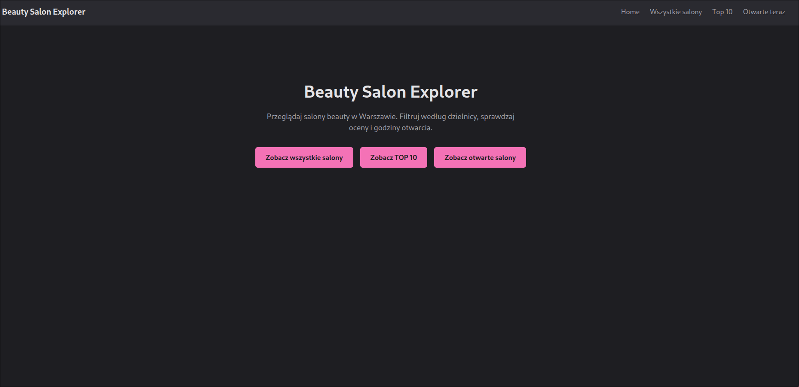
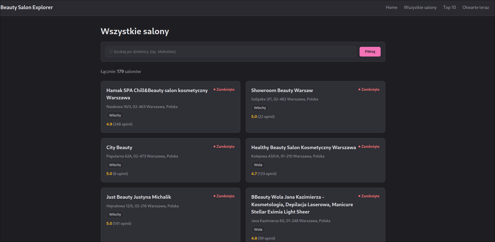
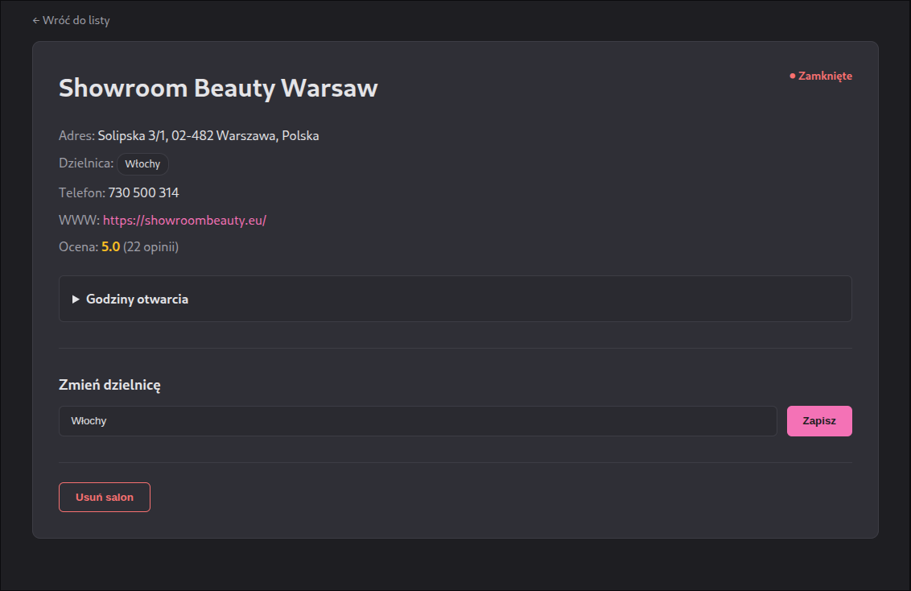
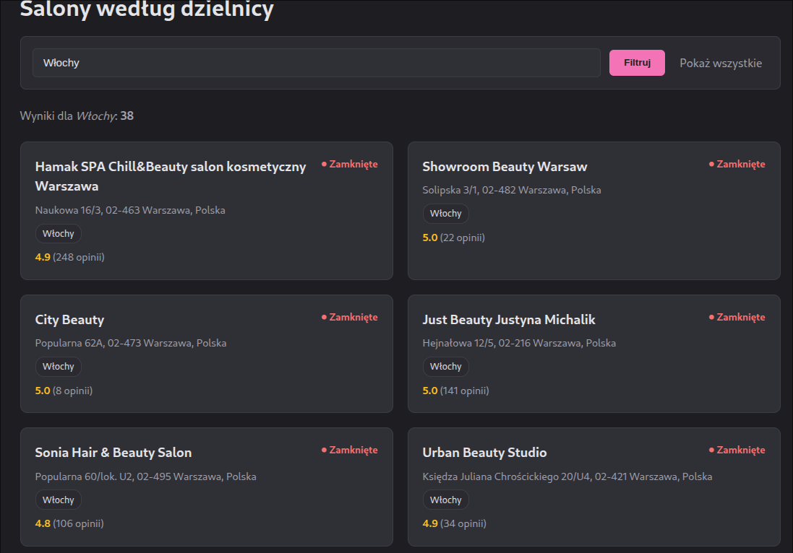
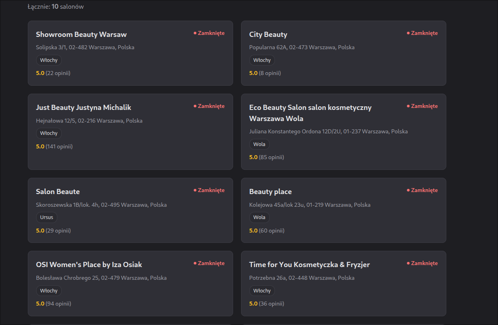

# Warsaw Beauty Salon Explorer

A small full-stack application that collects real data about hair and beauty salons in Warsaw from the Google Places API, stores it in a local database, and serves it through both a REST API and a simple Thymeleaf-based web UI.

**Author:** Andrzej Raczkowski — [github.com/rdhxb](https://github.com/rdhxb)

---

## Table of contents

1. [Overview](#overview)
2. [Tech stack](#tech-stack)
3. [Architecture](#architecture)
4. [Features](#features)
5. [Getting started](#getting-started)
   - [Path A — run with bundled data (no API key needed)](#path-a--run-with-bundled-data-no-api-key-needed)
   - [Path B — collect fresh data from Google Places API](#path-b--collect-fresh-data-from-google-places-api)
6. [REST API](#rest-api)
7. [Web UI](#web-ui)
8. [Screenshots](#screenshots)
9. [Design decisions](#design-decisions)
10. [Q&A — points worth discussing](#qa--points-worth-discussing)
11. [Future improvements](#future-improvements)

---

## Overview

The application has three layers, matching the three parts of the task:

1. **Data collection** — a `DataCollector` component queries the Google Places API (Text Search + Place Details) for beauty-related businesses in Warsaw, deduplicates results by `placeId`, and persists them to a local H2 database. The dataset covers ~100+ unique salons across multiple districts.
2. **Backend API** — a Spring Boot REST controller exposes the collected data and allows modifications.
3. **Frontend UI** — server-rendered Thymeleaf pages let the user browse the list, filter by district, view details, edit, and delete a salon.

The same application serves both the API and the UI on `http://localhost:8080`.

---

## Tech stack

| Layer | Technology |
| --- | --- |
| Language | Java 21 |
| Framework | Spring Boot 4.0.6 (Web MVC, Data JPA, Thymeleaf, DevTools) |
| Persistence | H2 (file-based) + Spring Data JPA / Hibernate |
| Templating | Thymeleaf |
| HTTP client | Java built-in `java.net.http.HttpClient` |
| JSON | Jackson |
| Build tool | Maven (with the included `mvnw` wrapper) |
| Code generation | Lombok (used to keep entity / service / controller boilerplate minimal) |
| External data source | Google Places API (New) — Text Search + Place Details |

> Spring Boot 4.0.6 is the latest stable, non-beta, non-snapshot release at the time of writing.

---

## Architecture

```
                   ┌─────────────────────────────┐
                   │   Google Places API (New)   │
                   │  Text Search + Place Details│
                   └──────────────┬──────────────┘
                                  │  (only when DB is empty
                                  │   AND API_KEY is set)
                                  ▼
 ┌────────────────────────────────────────────────────────────┐
 │                  Spring Boot application                    │
 │                                                             │
 │   DataCollector ──► SalonService ──► SalonRepository (JPA)  │
 │                          ▲                       │          │
 │                          │                       ▼          │
 │     SalonController      │              ┌──────────────┐    │
 │     (REST /api/salons)   │              │  H2 (file)   │    │
 │                          │              │  ./data/...  │    │
 │     SalonViewController  │              └──────────────┘    │
 │     (Thymeleaf pages /)  │                                  │
 │                                                             │
 └────────────────────────────────────────────────────────────┘
                                  │
                                  ▼
                       Browser  (http://localhost:8080)
```

A single `Salon` JPA entity stores: name, address, district, phone, website, rating, review count, "is open now" snapshot, and the weekly opening-hours description.

`DataCollector` runs **once** at startup via a `CommandLineRunner`, and only if the database is empty — so the API quota is never consumed on subsequent runs.

---

## Features

- Browse all salons in a card layout.
- Filter by district.
- Quick views: **Top 10 by rating** and **Open now**.
- Salon detail page with full address, phone, website, rating, review count and weekly opening hours.
- Edit a salon's district from the detail page.
- Delete a salon from the detail page.
- Equivalent REST endpoints for all of the above, suitable for an external client.
- H2 web console enabled at `/h2-console` for inspection.

---

## Getting started

### Requirements

- **JDK 21**
- A terminal — Maven is provided through the wrapper (`./mvnw` / `mvnw.cmd`), so no separate Maven install is needed.

### Path A — run with bundled data (no API key needed)

A populated H2 database is intentionally committed under `./data/salon_db.mv.db` so the project can be reviewed without setting up any external credentials.

```bash
# clone the repo
git clone https://github.com/rdhxb/beauty-salon-exproler
cd beautySalonExploler

# Linux / macOS
./mvnw spring-boot:run

# Windows
mvnw.cmd spring-boot:run
```

Then open <http://localhost:8080>.

Because the database already contains data, `DataCollector` detects that `repo.count() != 0` and skips the API call entirely — no key required.

### Path B — collect fresh data from Google Places API

If you want to re-collect the dataset from scratch:

1. Get an API key for the **Google Places API (New)** in the Google Cloud Console and enable the API. Google currently grants ~$300 in free credit for the first 90 days, which is more than enough for this dataset.
2. Delete the bundled database so the collector runs:
   ```bash
   rm -rf ./data
   ```
3. Export your key and start the app:
   ```bash
   # Linux / macOS
   export API_KEY=your_google_places_api_key_here
   ./mvnw spring-boot:run
   ```
   ```powershell
   # Windows PowerShell
   $env:API_KEY="your_google_places_api_key_here"
   .\mvnw.cmd spring-boot:run
   ```

On the first start, the collector will run a series of text queries (e.g. `salon beauty Warszawa`, `salon fryzjerski Warszawa`, `manicure Warszawa`, `barber shop Warszawa`, `spa Warszawa`, plus district-scoped queries for Mokotów, Śródmieście, Wola, Ursynów…), fetch full place details for each unique result, and persist them.

---

## REST API

Base URL: `http://localhost:8080/api/salons`

| Method | Endpoint | Description |
| --- | --- | --- |
| `GET` | `/api/salons` | List all salons |
| `GET` | `/api/salons/{id}` | Get a single salon by id |
| `GET` | `/api/salons/district/{district}` | List salons in a given district |
| `GET` | `/api/salons/open` | List salons currently marked as open |
| `GET` | `/api/salons/top10` | Top 10 salons by rating |
| `PATCH` | `/api/salons/{id}?district=Mokotów` | Update a salon's district |
| `DELETE` | `/api/salons/{id}` | Delete a salon |

### Example calls

```bash
# all salons
curl http://localhost:8080/api/salons

# one salon
curl http://localhost:8080/api/salons/1

# salons in Mokotów
curl http://localhost:8080/api/salons/district/Mokotów

# top 10 by rating
curl http://localhost:8080/api/salons/top10

# change district
curl -X PATCH "http://localhost:8080/api/salons/1?district=Wola"

# delete a salon
curl -X DELETE http://localhost:8080/api/salons/1
```

---

## Web UI

| Path | Page |
| --- | --- |
| `/` | Home / landing |
| `/salons` | All salons (cards) |
| `/salons/{id}` | Salon detail view + edit + delete |
| `/salons/top10` | Top 10 by rating |
| `/salons/open` | Open now |
| `/districts?district=Mokotów` | Filter by district |
| `/h2-console` | H2 web console (JDBC URL: `jdbc:h2:file:./data/salon_db`, user `root`, password `root`) |

---

## Screenshots


| Page | Image |
| --- | --- |
| Home |  |
| All salons |  |
| Salon detail |  |
| Districts filter |  |
| Top 10 |  |

---

## Design decisions

**Why this stack (Java + Spring Boot + Thymeleaf) and not Kotlin + React/Next.js?**
I chose tools I'm most comfortable with so I could focus on getting a complete, working end-to-end product within the time budget rather than learning a new framework on the fly. This project also doubles as good practice ahead of my engineering thesis, which uses the same stack.

**Why store data in a database instead of JSON/CSV?**
Using Spring Data JPA gives me CRUD, filtering, and derived queries (`findByDistrict`, `findByIsOpenTrue`) almost for free. Re-implementing those by hand on top of JSON or CSV would add code without adding value for a project of this size.

**Why H2 (file-based) specifically?**
Zero-setup: no separate server to install or run, and the database file (`./data/salon_db.mv.db`) can be committed to the repo so a reviewer can launch the app without any external credentials. For a small dataset (~100–200 salons) this is more than enough.

**Why Google Places API and not Booksy / Facebook / Yelp?**
I considered Booksy and Facebook first because they have richer, beauty-specific data, but neither offers a public API for this use case, and scraping them is explicitly disallowed by their terms of service. Yelp's Polish coverage is thin. Google Places API (New) turned out to be the best fit: it's a public, documented API, returns everything required by the task (name, address, district via `addressComponents`, phone, website, rating, review count, opening hours), and the ~$300 free credit for the first 90 days covers this dataset comfortably.

**Why Lombok?**
To avoid hand-written getters, setters, constructors and `@RequiredArgsConstructor` boilerplate. Keeps the entity, services and controllers focused on what they actually do. Reviewers need the Lombok plugin enabled in their IDE.

**Run-once data collection.**
The `CommandLineRunner` in `BeautySalonExprolerApplication` only calls `DataCollector` when the table is empty. This keeps the API quota safe across restarts and gives Path A (run without a key) a clean fallback.

---

## Q&A — points worth discussing

These are the questions from the task brief that I expect to come up in the conversation, with my short answers up front.

**Why this data source?**
See *Design decisions* above. In short: Booksy / Facebook have no public API and disallow scraping; Google Places New is public, well-documented, gives me every required field, and the free tier is enough.

**How did I handle missing or inconsistent data?**
- **Deduplication.** Every place is keyed by Google's `placeId`. The collector keeps a `Set<String> seenIds` and skips duplicates across all queries.
- **Missing fields.** Optional fields (phone, website) fall back to `"brak"` via `JsonNode.asString("brak")`. Numeric fields default to `0`. The UI hides the website link entirely when it is missing.
- **District extraction.** Google's `addressComponents` are inconsistent — district can appear as `sublocality`, `sublocality_level_1`, `administrative_area_level_3`, etc. The current implementation reads `sublocality`, which works for most Warsaw addresses; refining this is one of the listed improvements.

**How would I scale this to all of Poland?**
- Replace the hardcoded query list with a generated set of queries seeded from a list of Polish cities and districts (e.g. from GUS / OSM administrative boundaries).
- Swap H2 for PostgreSQL with proper indexes on `district`, `rating`, `is_open`, plus a geo column (lat/lng) and a PostGIS spatial index for radius queries.
- Add a city/region dimension to the `Salon` entity and to all endpoints.
- For freshness, schedule an incremental refresh per city (e.g. weekly) rather than full re-collection.

---

## Future improvements

Given more time, in roughly this order:

- **DTOs at the API boundary.** Right now `SalonController` returns JPA entities directly. A `SalonResponse` / `SalonDetailResponse` would decouple the API contract from the persistence model and make it safe to evolve the schema.
- **Input validation** with `jakarta.validation` (`@NotBlank`, `@Size`) on the edit endpoint.
- **Tests.** Repository tests, an MVC slice test for the REST controller, and at least a smoke test for the view controller.
- **Real search & filtering.** Today the filter is district-only. Add full-text search by name, multi-district filter, min-rating filter, "open now" combined with district, and service type once that field is collected.
- **Google Maps embed** on the salon detail page (static map preview + a "Directions" link). Storing lat/lng alongside the address would enable this.
- **Move secrets out of `application.properties`.** The H2 username/password are in plain text; for a real deployment they would come from environment variables or a secrets manager.
- **Scheduled refresh** of the dataset (see *How would I scale this to all of Poland?*).
